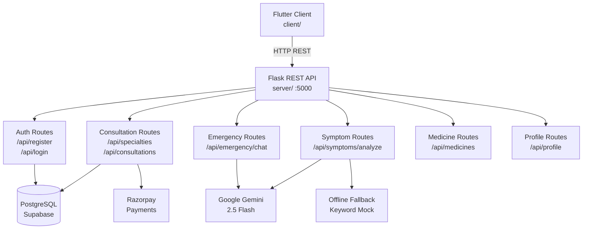

# NirogNet

**NirogNet** is a healthcare platform built to make medical services more accessible — particularly for underserved and rural communities in India. It connects patients with doctors, provides AI-assisted health guidance, and enables digital consultation booking and payment.

> Team project developed by students. See [Team](#team) section.

---

## Overview

Accessing quality healthcare in rural India often requires long travel, language barriers, and limited specialist availability. NirogNet addresses this with a mobile application that allows users to:

- Describe symptoms and receive AI-powered guidance
- Find and book consultations with available doctors by specialty
- Pay for consultations digitally via Razorpay
- Access medicine information and search a catalogue
- Get AI-assisted first-aid guidance during emergencies
- Manage their personal health profile

The application consists of a **Flutter mobile frontend** and a **Flask REST API backend**, connected over HTTP.

---

## Key Features

| Feature | Status | Notes |
|---|---|---|
| User registration and login | Implemented | JWT-based sessions (30-day expiry) |
| Health profile management | Implemented | Name, age, gender, blood group, blood pressure, language |
| AI symptom checker | Implemented | Google Gemini 2.5 Flash with keyword-based offline fallback |
| Doctor discovery by specialty | Implemented | Filters available doctors, joined with schedule and hospital |
| Slot-based consultation booking | Implemented | 15-minute slots, collision detection (Optional JWT fallback to user_id=1) |
| Consultation type selection | Implemented | Two appointment types supported |
| Razorpay payment integration | Implemented | Test-mode account, signature verification |
| AI emergency guidance (backend) | Implemented | Gemini-powered first-aid, returns database hospital list (without geographic filtering) + emergency numbers |
| Emergency assistant (frontend) | Simulated UI | In-app chat uses hardcoded responses — does not call the backend API |
| Offline emergency triage | Implemented | On-device symptom decision tree, no network required |
| Medicine catalogue | Implemented | Browse, search by name, filter by category |
| Password change | Implemented | Requires current password confirmation |

---

## Tech Stack

| Layer | Technology |
|---|---|
| Mobile Frontend | Flutter / Dart |
| Backend Framework | Flask 3.1 (Python) |
| Database | PostgreSQL (hosted on Supabase) |
| ORM | SQLAlchemy 2.0 + Flask-SQLAlchemy |
| Authentication | JWT via Flask-JWT-Extended (30-day access tokens) |
| Password Hashing | Werkzeug / Flask-Bcrypt |
| AI | Google Gemini 2.5 Flash (google-generativeai) |
| Payments | Razorpay (Python SDK + Flutter SDK) |
| CORS | Flask-CORS |
| Token Storage (client) | flutter_secure_storage |
| HTTP Client (client) | Dart http package |

---

## Architecture



---

## Application Flows

### Authentication

```
User opens app
  -> AuthCheck reads secure storage
  -> Token found -> navigate to main screen
  -> No token  -> navigate to /get_started

Register: POST /api/register {email, password, name, contact}
Login:    POST /api/login    {email, password}
          <- {access_token}  stored in FlutterSecureStorage

Authenticated requests include:
  Authorization: Bearer <token>
```

### Consultation Booking

```
GET /api/specialties           -> user picks a specialty
  -> GET /api/specialties/{id}/doctors  -> user picks a doctor
    -> GET /api/doctors/{id}/slots?date=YYYY-MM-DD  -> user picks a 15-min slot
      -> POST /api/consultations {doctor_id, date_time}
        -> POST /api/payments/create {consultation_id}
          <- {razorpay_order_id, amount, key}
            -> Razorpay SDK handles payment UI
              -> POST /api/payments/verify {...}
                <- consultation.status = "confirmed"
```

### Symptom Checker

```
User types symptoms (3-2000 chars)
  -> POST /api/symptoms/analyze {symptoms: "..."}
    -> Gemini 2.5 Flash generates response
    -> On Gemini failure -> keyword-based fallback response
  <- {reply, symptom_input, disclaimer}
```

### Emergency (Backend API)

```
POST /api/emergency/chat {message: "..."}
  -> Gemini generates 3-5 first-aid steps
  -> Hospitals table queried (returns stored records without geographic filtering)
<- {text, hospitals[], disclaimer, emergency_numbers}
```

> **Note:** The in-app Emergency Assistant screen uses simulated/hardcoded responses and does not call this backend endpoint. The offline triage screen runs a structured decision tree entirely on-device.

---

## Project Structure

```
nirognet_final/
+-- .gitignore
+-- README.md
|
+-- client/                          # Flutter frontend (package: cura)
|   +-- pubspec.yaml
|   +-- lib/
|       +-- main.dart                # App entry, AuthCheck, routing
|       +-- main_scaffold.dart       # App shell with bottom navigation
|       +-- utils/
|       |   +-- api_constants.dart   # Centralized endpoint definitions
|       +-- services/
|       |   +-- auth_service.dart    # (Contains independent baseUrl definition)
|       |   +-- consultation_service.dart
|       |   +-- payment_service.dart
|       |   +-- symptom_service.dart # (Contains independent baseUrl definition)
|       +-- models/
|       |   +-- specialty.dart / doctor.dart / consultation.dart
|       +-- screens/
|           +-- get_started.dart / login_page.dart / signup_page.dart
|           +-- homepage.dart
|           +-- profile_page.dart
|           +-- ai_symptom_checker_two.dart
|           +-- book_consultation_specialty.dart
|           +-- book_consultation_page.dart
|           +-- doctor_slots_page.dart
|           +-- consultation_mode_page.dart
|           +-- booking_success_page.dart
|           +-- emergency_assistant.dart      # (UI mock)
|           +-- emergency_assistance_offline.dart
|           +-- medicine_availability.dart
|           +-- medicine_category_screen.dart
|           +-- medicine_api_service.dart     # (Contains independent baseUrl definition)
|
+-- server/                          # Flask backend
    +-- run.py                       # Entry point (port 5000)
    +-- requirements.txt
    +-- .env.example
    +-- check_db.py
    +-- app/
        +-- __init__.py              # Flask app factory
        +-- extensions.py            # db, jwt instances
        +-- config/settings.py
        +-- models/models.py
        +-- routes/                  # Blueprint URL registration
        +-- controllers/             # Request validation + orchestration
        +-- services/                # Business logic + external API calls
        +-- middleware/
            +-- auth_middleware.py
            +-- error_handler.py
```

---

## API Overview

Full documentation: [docs/API.md](docs/API.md)

| Method | Endpoint | Auth | Purpose |
|--------|----------|------|---------|
| POST | `/api/register` | No | Create account |
| POST | `/api/login` | No | Login, receive JWT |
| GET | `/api/profile` | JWT | Get user profile |
| PUT | `/api/profile` | JWT | Update profile fields |
| PUT | `/api/profile/health` | JWT | Update blood group / BP |
| PUT | `/api/change-password` | JWT | Change password |
| GET | `/api/specialties` | No | List all specialties |
| GET | `/api/specialties/<id>/doctors` | No | Doctors by specialty + schedule |
| GET | `/api/doctors/<id>/slots?date=` | No | Available 15-min slots |
| POST | `/api/consultations` | Optional* | Book a consultation |
| GET | `/api/consultations` | JWT | User's consultations |
| PUT | `/api/consultations/<id>/type` | Optional* | Set appointment type |
| POST | `/api/payments/create` | Optional* | Create Razorpay order |
| POST | `/api/payments/verify` | No | Verify payment signature |
| POST | `/api/symptoms/analyze` | No | AI symptom analysis |
| POST | `/api/emergency/chat` | No | AI emergency guidance + hospital listing |
| GET | `/api/medicines` | No | All medicines |
| GET | `/api/medicines/search?name=` | No | Search by name |
| GET | `/api/medicines/category/<cat>` | No | Filter by category |
| GET | `/api/medicines/<id>` | No | Single medicine |
| GET | `/health` | No | Backend health check |

> *Optional JWT: uses `verify_jwt_in_request(optional=True)`. Without a token, user_id defaults to 1.

---

## Getting Started

### Prerequisites

- Python 3.10+
- Flutter 3.x (with Dart)
- PostgreSQL database (such as Supabase)
- Google Gemini API key (obtain from Google AI Studio)
- Razorpay test account (obtain from Razorpay Dashboard)

### Backend Setup

```bash
cd server

# Create and activate virtual environment
python -m venv venv
venv\Scripts\activate        # Windows
# source venv/bin/activate   # Linux/macOS

# Install dependencies
pip install -r requirements.txt

# Configure environment
cp .env.example .env
# Edit .env with your values

# Run the server
python run.py
# Starts on http://0.0.0.0:5000
```

### Frontend Setup

```bash
cd client

# Install dependencies
flutter pub get

# Configure API base URLs if needed across:
# - lib/utils/api_constants.dart
# - lib/services/auth_service.dart
# - lib/services/symptom_service.dart
# - lib/screens/medicine_api_service.dart

# Run the app
flutter run
```

**API URL by scenario:**

| Scenario | URL |
|---|---|
| Android emulator | `http://10.0.2.2:5000/api` (default) |
| Physical device (same Wi-Fi) | `http://192.168.x.x:5000/api` |
| iOS simulator | `http://localhost:5000/api` |
| Web | `http://localhost:5000/api` |

---

## Environment Variables

See [`server/.env.example`](server/.env.example) for the full template.

| Variable | Required | Purpose |
|---|---|---|
| `DATABASE_URL` | Yes | PostgreSQL connection string |
| `SECRET_KEY` | Yes | Flask session signing key |
| `JWT_SECRET_KEY` | Yes | JWT token signing key |
| `GEMINI_API_KEY` | Yes | Google Gemini AI access |
| `RAZORPAY_KEY_ID` | Yes | Razorpay payment key |
| `RAZORPAY_KEY_SECRET` | Yes | Razorpay payment secret |

If `GEMINI_API_KEY` is absent, the symptom checker uses a keyword-based fallback. The emergency backend returns a static safe message.

---

## Current Limitations

- **API base URLs are independently hardcoded** across multiple client files (`api_constants.dart`, `auth_service.dart`, `symptom_service.dart`, `medicine_api_service.dart`) to the Android emulator address. All must be updated for physical devices or production.
- **Emergency assistant screen** uses simulated responses and does not call the backend emergency API.
- **Emergency backend endpoint** returns hospital records stored in the database without geographic proximity filtering.
- **Homepage dashboard** shows static hardcoded data, not fetched dynamically from the database.
- **Consultation booking** uses optional JWT — unauthenticated requests default to `user_id=1` (development convenience, clearly marked "TEMP JWT BYPASS" in code).
- **Razorpay is in test mode.** Live payments require production keys and additional configuration.
- **No per-medicine stock/inventory** data — the medicines table stores name, category, and description only.
- **`SECRET_KEY` and `JWT_SECRET_KEY`** fall back to insecure hardcoded values if not set in `.env`.

---

## Future Improvements

The following are identified as potential next steps, not currently implemented:

- Centralize all frontend API base URLs to a single configuration source
- Dynamic homepage dashboard with real user data
- Full JWT enforcement on all booking and payment endpoints
- Push notifications
- Geolocation-based hospital search
- Production deployment configuration
- Expanded medicine inventory with stock levels
- Multi-language AI responses based on user language preference

---

## Documentation

| Document | Description |
|---|---|
| [docs/ARCHITECTURE.md](docs/ARCHITECTURE.md) | Detailed system architecture |
| [docs/API.md](docs/API.md) | All API endpoints with request/response details |
| [docs/SETUP.md](docs/SETUP.md) | Developer setup guide |
| [docs/PROJECT_OVERVIEW.md](docs/PROJECT_OVERVIEW.md) | Project overview for interviews and presentations |

---

## Team

NirogNet was developed as a team project.

| Name | LinkedIn |
|---|---|
| Parthiv Ghosh | https://www.linkedin.com/in/parthiv-ghosh-479a7b275 |
| Shubhamita Majumder | https://www.linkedin.com/in/shubhamita-majumder-69264b30a/ |
| Neha Pani | https://www.linkedin.com/in/neha-pani/ |
| Protyush Banik | https://www.linkedin.com/in/protyush-banik/ |
| Ritwika Banerjee | https://www.linkedin.com/in/ritwika-banerjee-5a9207360/ |

---

## Repository

https://github.com/Shubhamita2005/nirognet
